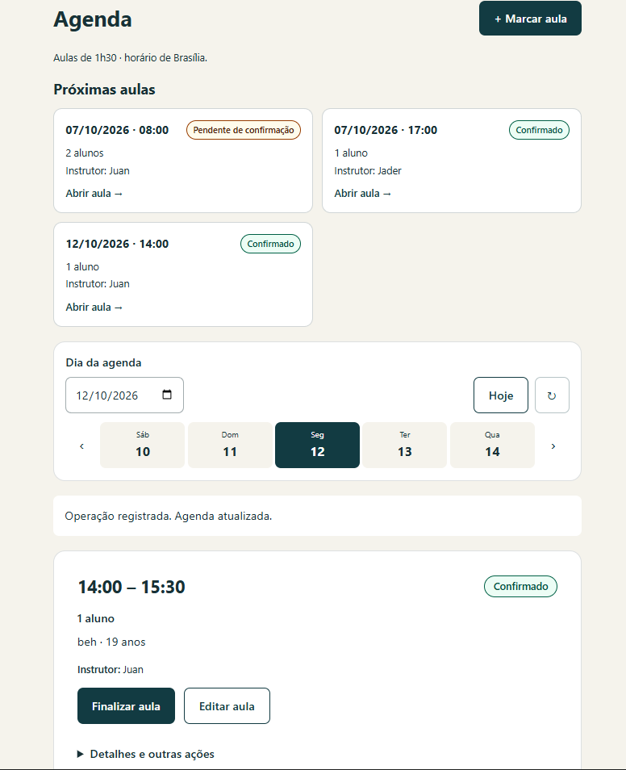
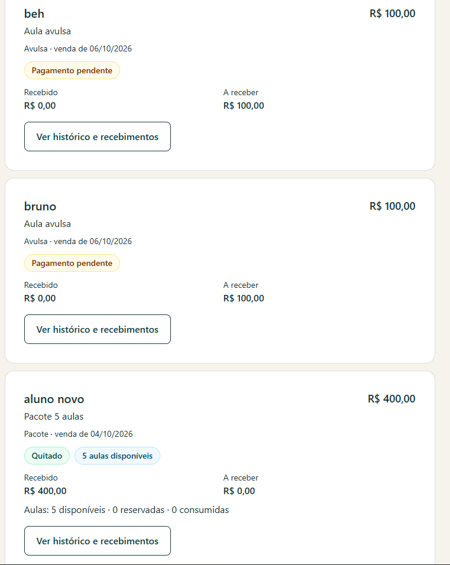
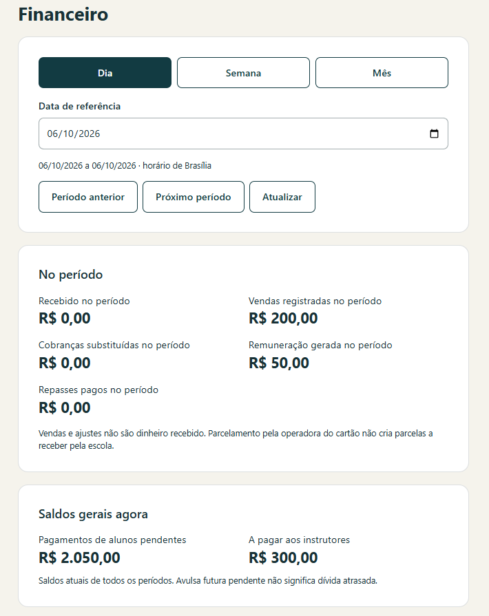
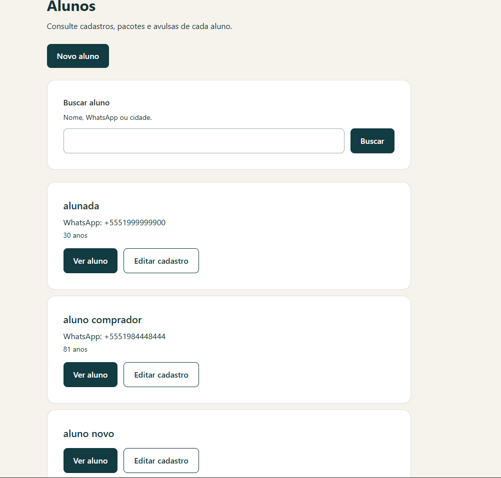
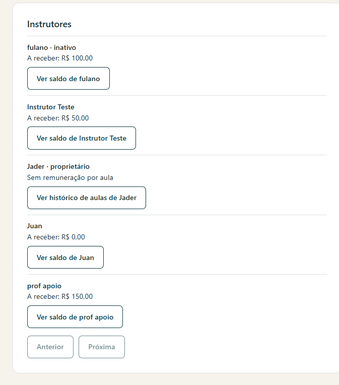
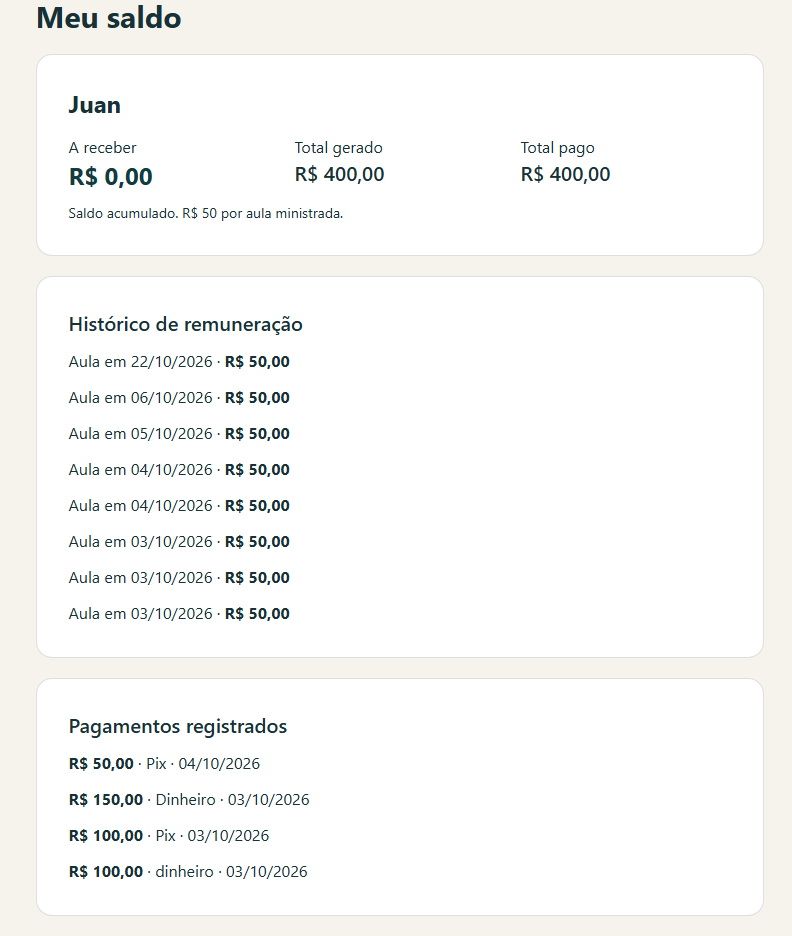

# Primeira Onda OPS

[English](README.md) | [Português](README.pt-BR.md)

**Um sistema real de gestão operacional desenvolvido para uma escola de surf.**

O Primeira Onda OPS foi criado para substituir processos manuais por uma aplicação web centralizada para gestão de alunos, agenda de aulas, pacotes, pagamentos, instrutores e da operação diária da escola.

> O código-fonte de produção é privado. Este repositório é um case público do projeto.

---

## O problema

A operação da escola dependia bastante de coordenação manual e de informações distribuídas entre conversas, memória e controles isolados.

Conforme a operação cresce, isso gera problemas previsíveis:

- a agenda fica mais difícil de coordenar;
- dados de alunos e pacotes ficam fragmentados;
- o uso de créditos fica mais difícil de acompanhar;
- atribuição de instrutores e repasses exigem controle manual;
- informações financeiras e operacionais podem se misturar;
- o acesso a dados sensíveis precisa variar conforme o papel de cada pessoa.

O objetivo do Primeira Onda OPS foi transformar esses fluxos em um único sistema operacional desenhado em torno da forma real como a escola funciona.

---

## A solução

O Primeira Onda OPS centraliza os principais fluxos da escola em uma aplicação mobile-first.

### Principais funcionalidades

- Cadastro, busca e gestão de alunos
- Agendamento de aulas de surf
- Horários padrão e excepcionais
- Aulas com múltiplos alunos e instrutores
- Gestão de pacotes e créditos
- Controle de pagamentos
- Fluxos de status e conclusão de aulas
- Remuneração e repasses de instrutores
- Controle de acesso por owner, administradores e instrutores
- Visões específicas da agenda do instrutor
- Resumos operacionais e financeiros
- Instalação como Progressive Web App (PWA) em dispositivos compatíveis

O sistema foi criado para um fluxo de negócio real, e não como um CRUD genérico de estudo.

---

## Visão do produto

### Agenda e operação das aulas

A agenda reúne próximas aulas, status de confirmação, instrutores, quantidade de alunos e gestão diária das aulas em uma única visão operacional.

### Pacotes, aulas avulsas e pagamentos

As vendas podem representar pacotes ou aulas avulsas, mantendo separados status de pagamento, valores recebidos, saldo pendente e créditos de aula disponíveis.

### Visão financeira

Administradores podem acompanhar vendas, recebimentos, remuneração de instrutores, repasses e saldos atuais em períodos diários, semanais e mensais.

### Gestão de alunos

Os cadastros de alunos podem ser pesquisados e gerenciados de forma centralizada com os dados operacionais necessários para a escola.

### Gestão de instrutores

A visão operacional separa os saldos e responsabilidades dos instrutores, incluindo a diferença entre instrutores comuns e o proprietário da escola.

### Saldo e histórico do instrutor

Cada instrutor pode consultar seus próprios ganhos gerados, valores pagos e histórico de pagamentos sem receber acesso desnecessário ao restante das informações financeiras da escola.

---

## Regras de negócio modeladas no software

Alguns exemplos de regras operacionais tratadas pelo sistema:

- as aulas normalmente duram 90 minutos;
- uma aula pode incluir vários alunos e instrutores;
- créditos de pacote são controlados por participante;
- créditos não podem ser consumidos de pacotes não pagos;
- a conclusão da aula determina o consumo do crédito;
- a remuneração do instrutor é gerada por aula concluída;
- repasses são controlados separadamente da remuneração gerada;
- o instrutor acessa somente as informações necessárias para o próprio trabalho;
- operações administrativas e financeiras sensíveis são restritas por papel.

Compras históricas, preços, movimentações de crédito e registros financeiros são preservados em vez de serem recalculados com base no catálogo atual.

---

## Arquitetura

O Primeira Onda OPS utiliza uma arquitetura full-stack enxuta, pensada para uma aplicação de pequena empresa com forte necessidade de integridade dos dados.

### Frontend

- React
- TypeScript
- Vite
- Tailwind CSS
- React Router

### Backend e dados

- Supabase Auth
- PostgreSQL
- Row Level Security (RLS)
- Funções PostgreSQL / RPCs
- Supabase Edge Functions

### Entrega

- Cloudflare Pages
- Progressive Web App
- Interface responsiva e mobile-first

O navegador recebe somente a configuração pública apropriada. Operações privilegiadas permanecem no servidor.

---

## Segurança e integridade dos dados

Um dos objetivos principais do projeto foi evitar depender apenas de validações no frontend.

Regras críticas de negócio são protegidas por mecanismos de banco e servidor, incluindo:

- Row Level Security
- autorização por papel
- constraints de banco
- operações transacionais
- proteções de idempotência
- fluxos preparados para concorrência
- funções privilegiadas restritas
- histórico auditável

A aplicação foi projetada para evitar problemas comuns como ações duplicadas, escalada indevida de privilégios, acesso cruzado entre usuários e operações financeiras parciais.

---

## Testes e confiabilidade

O projeto trata regressão automatizada como parte central do desenvolvimento.

As verificações atuais incluem:

- testes unitários e de integração
- testes SQL e de autorização
- testes de comportamento da interface
- cobertura de regressão
- lint
- validação TypeScript
- validação do build de produção
- validação da PWA

No estágio atual, o projeto chegou a **475 testes automatizados em 86 arquivos de teste**, com lint, TypeScript e build aprovados na validação registrada mais recente.

Mudanças críticas normalmente seguem um fluxo semelhante a:

**RED → GREEN → REGRESSION**

Os testes automatizados são combinados com validação manual de fluxos reais e de comportamentos específicos do ambiente.

---

## Progressive Web App

O Primeira Onda OPS pode ser instalado como PWA em dispositivos Android e iOS compatíveis.

A camada PWA foi mantida propositalmente conservadora:

- assets da aplicação podem ser cacheados;
- respostas de Supabase/Auth/dados de negócio não são cacheadas para operação offline;
- os módulos operacionais continuam exigindo conexão;
- atualizações são oferecidas explicitamente ao usuário em vez de forçar recarga durante um formulário ativo.

---

## Status do projeto

O sistema está em desenvolvimento ativo e já concluiu seus principais módulos operacionais.

O repositório de produção continua privado porque contém a implementação real e regras específicas do negócio.

Este repositório público existe para documentar arquitetura, decisões de produto e o trabalho de engenharia realizado no projeto.

---

## O que este projeto demonstra

O Primeira Onda OPS representa o tipo de trabalho que eu busco desenvolver:

- software voltado para problemas operacionais reais;
- sistemas internos sob medida para empresas;
- automação de processos manuais;
- modelos confiáveis de dados e permissões;
- interfaces desenhadas para uso diário real;
- desenvolvimento rápido sem tratar qualidade e testes como opcionais.

---

## Desenvolvedor

**Juan Vieira**  
Software Developer

[Perfil no GitHub](https://github.com/juanbvdev)
